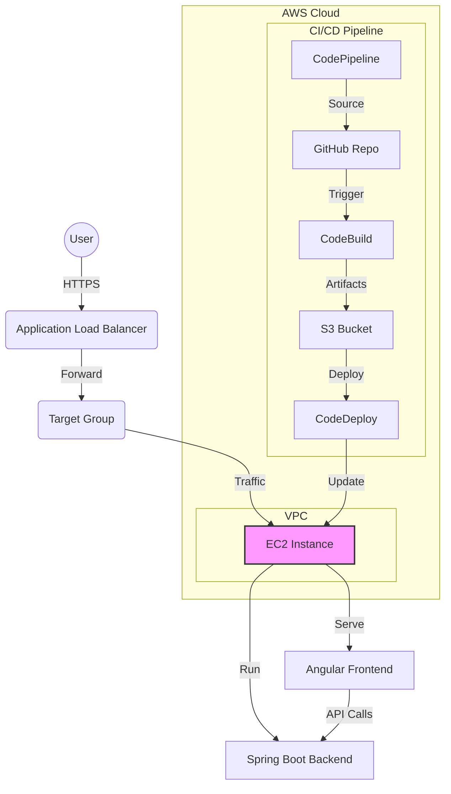

# End-to-End CI/CD Pipeline with Java Spring Boot & Angular


A complete, production-ready CI/CD pipeline implementation demonstrating modern DevOps practices on AWS. This project automates the build, test, and deployment process for a full-stack Java Spring Boot and Angular application.

## 🚀 Key Features

- **Full-Stack Application**: Java Spring Boot 3.2 backend with Angular 17 frontend
- **Automated Pipeline**: End-to-end automation using AWS CodePipeline
- **Infrastructure as Code**: Entire infrastructure provisioned via AWS CLI scripts
- **Zero Downtime Deployment**: Blue/Green deployment strategy using AWS CodeDeploy
- **Optimized Performance**: memory-efficient configuration for t2.micro instances
- **Monitoring**: Integrated health checks and uptime monitoring

## 🏗️ Architecture

## 🏗️ Architecture



The pipeline consists of:
1. **Source**: GitHub repository with webhooks
2. **Build**: AWS CodeBuild compiles Java & Angular, runs tests
3. **Deploy**: AWS CodeDeploy manages deployment to EC2 fleet
4. **Hosting**: Nginx reverse proxy serving Angular and proxying API calls to Spring Boot

## 📁 Project Structure

```
ete-cicd-aws/
├── backend/                    # Java Spring Boot
│   ├── src/main/java/
│   ├── src/main/resources/
│   ├── src/test/java/
│   └── pom.xml
├── frontend/                   # Angular 17
│   ├── src/app/
│   ├── src/environments/
│   ├── angular.json
│   └── package.json
├── nginx/
│   └── nginx.conf             # Reverse proxy config
├── scripts/                   # Deployment scripts
├── buildspec.yml              # CodeBuild configuration
└── appspec.yml                # CodeDeploy configuration
```

## 🔧 Local Development

### Prerequisites
- Java 17
- Maven 3.6+
- Node.js 18+
- Angular CLI 17

### Backend (Spring Boot)

```bash
cd backend
mvn clean install
mvn spring-boot:run
```

Backend runs on `http://localhost:8080`

**API Endpoints:**
- `GET /` - Welcome message
- `GET /health` - Health check with memory info
- `GET /api/info` - Application information

### Frontend (Angular)

```bash
cd frontend
npm install
npm start
```

Frontend runs on `http://localhost:4200`

### Run Tests

```bash
# Backend tests
cd backend
mvn test

# Frontend tests
cd frontend
npm test
```

## 🏗️ Build Process

### CodeBuild Steps

1. **Install Phase:** Java 17 + Node.js 18
2. **Pre-build:** Build Angular frontend (`npm run build`)
3. **Build:** Build Spring Boot backend (`mvn package`)
4. **Artifacts:** Package both frontend and backend

### Memory Optimization for t2.micro

**Spring Boot JVM Settings:**
```
-Xmx256m -Xms128m -XX:+UseSerialGC
```

**Undertow Configuration:**
- IO threads: 2
- Worker threads: 8
- Buffer size: 512 bytes

## 🚀 Deployment Architecture

```
User Request → Nginx (Port 80)
                ├─→ Static Files (Angular)
                └─→ /api/* → Spring Boot (Port 8080)
```

**Nginx Configuration:**
- Serves Angular SPA from `/usr/share/nginx/html/`
- Proxies `/api/*` and `/health` to Spring Boot on port 8080
- Handles SPA routing (all routes → index.html)

## 📊 Pipeline Stages

### 1. Source
- **Trigger:** Push to `main` branch
- **Source:** GitHub via CodeStar Connection

### 2. Build
- **Duration:** ~3-5 minutes
- **Actions:**
  - Install dependencies
  - Build Angular (production mode)
  - Build Spring Boot (run tests)
  - Cache Maven & npm dependencies

### 3. Deploy
- **Target:** EC2 with tag `DeploymentGroup=Production-Fleet`
- **Steps:**
  1. Install Java 17 & Nginx
  2. Deploy Angular to Nginx
  3. Stop old Java process
  4. Start new Spring Boot app
  5. Validate health endpoints

## 🔍 Monitoring

### Health Check
```bash
curl http://YOUR_EC2_IP/health
```

Response:
```json
{
  "status": "healthy",
  "timestamp": "2026-02-11T...",
  "uptime": 123.45,
  "memory": {
    "max": "256 MB",
    "used": "128 MB",
    "free": "128 MB"
  }
}
```

### Application Logs
```bash
# Backend logs
tail -f /home/ec2-user/app/backend.log

# Nginx logs
sudo tail -f /var/log/nginx/access.log
sudo tail -f /var/log/nginx/error.log
```

## 🎯 Key Features

✅ **Optimized for t2.micro** - Runs comfortably in 1GB RAM  
✅ **Automated Testing** - JUnit + Karma tests in pipeline  
✅ **Zero Downtime** - Graceful shutdown and startup  
✅ **Health Monitoring** - Real-time memory and uptime tracking  
✅ **SPA Support** - Nginx handles Angular routing  
✅ **API Proxy** - Clean separation of frontend/backend  

## 🔐 Security Group Ports

- **22** - SSH
- **80** - HTTP (Nginx)
- **8080** - Spring Boot (optional, for direct access)

## 📝 Environment Variables

### Development
- `apiUrl: 'http://localhost:8080'`

### Production
- `apiUrl: ''` (empty = same origin, Nginx proxies)

## 🐛 Troubleshooting

### Build Fails
```bash
# Check CodeBuild logs in AWS Console
# Common issues:
# - Maven dependency resolution
# - Angular build errors
# - Test failures
```

### Deployment Fails
```bash
# SSH into EC2
ssh -i your-key.pem ec2-user@YOUR_EC2_IP

# Check Java process
ps aux | grep java

# Check Nginx
sudo systemctl status nginx

# View logs
tail -50 /home/ec2-user/app/backend.log
```

### Application Not Responding
```bash
# Check if Spring Boot is running
curl http://localhost:8080/health

# Check if Nginx is running
curl http://localhost:80

# Restart services
sudo systemctl restart nginx
# Kill and restart Java manually if needed
```

## 📚 Documentation

- [Implementation Plan](docs/IMPLEMENTATION_PLAN.md)
- [Architecture](docs/ARCHITECTURE.md)
- [Troubleshooting Guide](docs/TROUBLESHOOTING.md)

## 🎓 What You'll Learn

- Building full-stack applications with Java + Angular
- Optimizing Spring Boot for low-memory environments
- Configuring Nginx as a reverse proxy
- AWS CI/CD pipeline automation
- Infrastructure as Code principles
- Automated testing in CI/CD

## 📄 License

MIT License - feel free to use this as a template for your own projects!

---

**Built with ❤️ for learning AWS DevOps**
