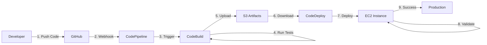

# End-to-End CI/CD Pipeline on AWS

[](https://aws.amazon.com/codepipeline/)
[](https://aws.amazon.com/codebuild/)
[](https://aws.amazon.com/codedeploy/)
[](https://nodejs.org/)

A complete, production-ready CI/CD pipeline using AWS native DevOps services that automatically pulls code from GitHub, builds the application, runs tests, and deploys to EC2 instances.

## 🎯 What This Project Demonstrates

- **Automated CI/CD**: Full automation from code push to production deployment
- **AWS Native Services**: CodePipeline, CodeBuild, CodeDeploy
- **Infrastructure as Code**: Scripted setup for reproducibility
- **Security Best Practices**: IAM roles with least-privilege access
- **Monitoring & Logging**: CloudWatch integration
- **Auto-Rollback**: Automatic rollback on deployment failures

## 🏗️ Architecture

```
┌─────────────┐      ┌──────────────────┐      ┌─────────────┐
│   GitHub    │─────▶│  CodePipeline    │─────▶│  CodeBuild  │
│ Repository  │      │  (Orchestration) │      │   (Build)   │
└─────────────┘      └──────────────────┘      └─────────────┘
                              │                        │
                              │                        ▼
                              │                 ┌─────────────┐
                              │                 │ S3 Artifacts│
                              │                 └─────────────┘
                              │                        │
                              ▼                        │
                     ┌──────────────────┐             │
                     │   CodeDeploy     │◀────────────┘
                     │   (Deployment)   │
                     └──────────────────┘
                              │
                              ▼
                     ┌──────────────────┐
                     │  EC2 Instance(s) │
                     │  (Production)    │
                     └──────────────────┘
```

## 🚀 Quick Start

### Prerequisites

- AWS Account with appropriate permissions
- AWS CLI installed and configured
- GitHub account
- SSH key pair for EC2 access

### 1. Clone the Repository

```bash
git clone https://github.com/YOUR_USERNAME/ete-cicd-aws.git
cd ete-cicd-aws
```

### 2. Set Up IAM Roles

```bash
# Create all required IAM roles
./scripts/setup-iam-roles.sh
```

### 3. Create S3 Bucket

```bash
# Create artifact storage bucket
chmod +x infrastructure/setup-s3.sh
./infrastructure/setup-s3.sh
```

### 4. Launch EC2 Instance

```bash
# Update configuration in setup-ec2.sh first
chmod +x infrastructure/setup-ec2.sh
./infrastructure/setup-ec2.sh
```

### 5. Create Pipeline

Follow the detailed instructions in [docs/SETUP_GUIDE.md](docs/SETUP_GUIDE.md)

## 📁 Project Structure

```
ete-cicd-aws/
├── sample-app/              # Node.js application
│   ├── app.js              # Express.js server
│   ├── package.json        # Dependencies
│   └── test/               # Jest unit tests
├── scripts/                # Deployment lifecycle scripts
│   ├── install_dependencies.sh
│   ├── start_server.sh
│   ├── stop_server.sh
│   └── validate_service.sh
├── iam/                    # IAM policies and roles
│   ├── codepipeline-*.json
│   ├── codebuild-*.json
│   ├── codedeploy-*.json
│   └── ec2-*.json
├── infrastructure/         # Infrastructure setup scripts
│   ├── setup-s3.sh
│   ├── setup-ec2.sh
│   └── user-data.sh
├── aws-config/            # AWS service configurations
│   ├── codebuild-project.json
│   ├── codedeploy-application.json
│   └── codepipeline.json
├── docs/                  # Documentation
│   ├── SETUP_GUIDE.md
│   ├── ARCHITECTURE.md
│   └── TROUBLESHOOTING.md
├── buildspec.yml          # CodeBuild build specification
├── appspec.yml            # CodeDeploy deployment specification
└── README.md
```

## 🔧 AWS Services Used

| Service | Purpose | Cost |
|---------|---------|------|
| **CodePipeline** | Orchestrates the CI/CD workflow | 1 free pipeline/month |
| **CodeBuild** | Builds and tests the application | 100 free minutes/month |
| **CodeDeploy** | Deploys to EC2 instances | Free for EC2 |
| **EC2** | Hosts the application | t2.micro free tier eligible |
| **S3** | Stores pipeline artifacts | 5 GB free tier |
| **IAM** | Access control and security | Free |
| **CloudWatch** | Logging and monitoring | 5 GB free tier |

## 📊 Pipeline Stages

### 1. Source Stage
- Monitors GitHub repository for changes
- Automatically triggers on code push to main branch
- Uses CodeStar Connections for GitHub integration

### 2. Build Stage
- Installs Node.js dependencies
- Runs unit tests with Jest
- Generates code coverage reports
- Packages artifacts for deployment

### 3. Deploy Stage
- Deploys to EC2 instances tagged with deployment group
- Runs lifecycle hooks (stop, install, start, validate)
- Performs health checks
- Auto-rollback on failure

## 🧪 Testing the Application

### Local Testing

```bash
cd sample-app
npm install
npm test
npm start
```

Access at `http://localhost:3000`

### Endpoints

- `GET /` - Welcome message
- `GET /health` - Health check
- `GET /api/info` - Application information

### After Deployment

```bash
# Get EC2 instance IP
INSTANCE_IP=$(aws ec2 describe-instances \
  --filters "Name=tag:Name,Values=CICD-App-Server" \
  --query 'Reservations[0].Instances[0].PublicIpAddress' \
  --output text)

# Test endpoints
curl http://$INSTANCE_IP:3000
curl http://$INSTANCE_IP:3000/health
curl http://$INSTANCE_IP:3000/api/info
```

## 📚 Documentation

- **[Setup Guide](docs/SETUP_GUIDE.md)** - Step-by-step setup instructions
- **[Architecture](docs/ARCHITECTURE.md)** - Detailed architecture documentation
- **[Troubleshooting](docs/TROUBLESHOOTING.md)** - Common issues and solutions

## 🔒 Security Features

- **IAM Roles**: Least-privilege access policies for all services
- **Encryption**: S3 bucket encryption at rest (AES-256)
- **No Hardcoded Credentials**: Uses IAM roles and instance profiles
- **Security Groups**: Minimal port exposure
- **Audit Logging**: CloudTrail integration for compliance

## 💰 Cost Estimate

**Free Tier Usage**: ~$0/month (within free tier limits)

**Beyond Free Tier**:
- EC2 t2.micro: ~$8.50/month
- S3 storage: ~$0.023/GB/month
- CodeBuild: $0.005/build minute
- Data transfer: Variable

**Cost Optimization Tips**:
- Use S3 lifecycle policies to delete old artifacts
- Stop EC2 instances when not in use (dev/test)
- Enable CodeBuild caching to reduce build time

## 🔄 CI/CD Workflow



## 🚦 Deployment Lifecycle

1. **ApplicationStop**: Stop the running application
2. **BeforeInstall**: Install Node.js and dependencies
3. **ApplicationStart**: Start the application
4. **ValidateService**: Run health checks

## 📈 Monitoring & Logs

### CloudWatch Logs

- `/aws/codebuild/cicd-demo` - Build logs
- `/aws/codedeploy/` - Deployment logs
- `/aws/ec2/` - Application logs

### Viewing Logs

```bash
# CodeBuild logs
aws logs tail /aws/codebuild/cicd-demo --follow

# Application logs (on EC2)
ssh -i ~/.ssh/YOUR_KEY.pem ec2-user@INSTANCE_IP
tail -f /home/ec2-user/app/app.log
```

## 🔧 Customization

### Change Deployment Strategy

Edit `aws-config/codedeploy-application.json`:
- `CodeDeployDefault.OneAtATime` - Deploy to one instance at a time
- `CodeDeployDefault.HalfAtATime` - Deploy to half the instances
- `CodeDeployDefault.AllAtOnce` - Deploy to all instances simultaneously

### Add Manual Approval

Add an approval stage to the pipeline:

```json
{
  "name": "Approval",
  "actions": [{
    "name": "ManualApproval",
    "actionTypeId": {
      "category": "Approval",
      "owner": "AWS",
      "provider": "Manual",
      "version": "1"
    }
  }]
}
```

## 🎓 Learning Outcomes

After completing this project, you will understand:

- ✅ AWS CodePipeline orchestration
- ✅ CodeBuild build automation
- ✅ CodeDeploy deployment strategies
- ✅ IAM roles and policies
- ✅ EC2 instance management
- ✅ S3 artifact storage
- ✅ CloudWatch logging and monitoring
- ✅ CI/CD best practices

## 🤝 Contributing

Contributions are welcome! Please feel free to submit a Pull Request.

## 📝 License

This project is licensed under the MIT License - see the LICENSE file for details.

## 🔗 References

- [AWS CodePipeline Documentation](https://docs.aws.amazon.com/codepipeline/)
- [AWS CodeBuild Documentation](https://docs.aws.amazon.com/codebuild/)
- [AWS CodeDeploy Documentation](https://docs.aws.amazon.com/codedeploy/)
- [CodeBuild buildspec Reference](https://docs.aws.amazon.com/codebuild/latest/userguide/build-spec-ref.html)
- [CodeDeploy appspec Reference](https://docs.aws.amazon.com/codedeploy/latest/userguide/reference-appspec-file.html)

## 📧 Support

For issues and questions:
- Open an issue on GitHub
- Check the [Troubleshooting Guide](docs/TROUBLESHOOTING.md)
- Refer to AWS documentation

---

**Built with ❤️ using AWS DevOps Services**
