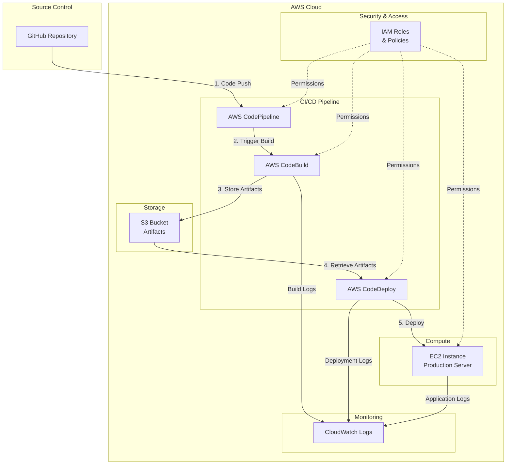
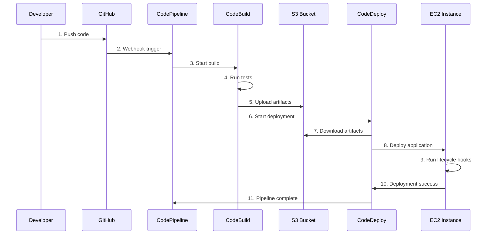

# AWS CI/CD Pipeline Architecture

## Overview

This document describes the architecture of the end-to-end CI/CD pipeline built using AWS native DevOps services.

## System Architecture

## Component Descriptions

### 1. Source Stage - GitHub

**Purpose**: Version control and source code repository

**Key Features**:
- Hosts application code, configuration files, and deployment scripts
- Triggers pipeline on code push to main branch
- Connected via AWS CodeStar Connections

**Files**:
- `sample-app/` - Node.js application
- `buildspec.yml` - Build instructions
- `appspec.yml` - Deployment instructions
- `scripts/` - Deployment lifecycle scripts

---

### 2. AWS CodePipeline

**Purpose**: Orchestrates the entire CI/CD workflow

**Key Features**:
- Automatically triggers on source code changes
- Manages artifact flow between stages
- Provides visual pipeline status
- Supports manual approval gates (optional)

**Stages**:
1. **Source**: Pulls code from GitHub
2. **Build**: Invokes CodeBuild project
3. **Deploy**: Invokes CodeDeploy application

**IAM Permissions**:
- Read/write access to S3 artifact bucket
- Invoke CodeBuild projects
- Create CodeDeploy deployments
- Use CodeStar connections

---

### 3. AWS CodeBuild

**Purpose**: Builds and tests the application

**Build Process**:
1. **Install Phase**: Install Node.js runtime and dependencies
2. **Pre-Build Phase**: Run linting and code quality checks
3. **Build Phase**: Execute unit tests with Jest
4. **Post-Build Phase**: Package artifacts for deployment

**Environment**:
- **Image**: `aws/codebuild/standard:5.0`
- **Compute**: `BUILD_GENERAL1_SMALL` (3 GB memory, 2 vCPUs)
- **Runtime**: Node.js 14

**Outputs**:
- Build artifacts stored in S3
- Test reports and code coverage
- CloudWatch Logs for debugging

**IAM Permissions**:
- Read/write access to S3 artifact bucket
- Create CloudWatch log streams
- Publish test reports

---

### 4. AWS CodeDeploy

**Purpose**: Deploys application to EC2 instances

**Deployment Configuration**:
- **Deployment Type**: In-place
- **Deployment Strategy**: `CodeDeployDefault.OneAtATime`
- **Target**: EC2 instances tagged with `DeploymentGroup=Production-Fleet`

**Lifecycle Events**:
1. **ApplicationStop**: Stop running application
2. **BeforeInstall**: Install Node.js and dependencies
3. **ApplicationStart**: Start the application
4. **ValidateService**: Health check validation

**Auto-Rollback**:
- Enabled on deployment failure
- Enabled on CloudWatch alarm triggers

**IAM Permissions**:
- Describe and manage EC2 instances
- Read from S3 artifact bucket
- Manage Auto Scaling lifecycle hooks

---

### 5. EC2 Instance

**Purpose**: Hosts the production application

**Configuration**:
- **Instance Type**: t2.micro (free tier eligible)
- **OS**: Amazon Linux 2
- **Runtime**: Node.js 14
- **Application Port**: 3000

**Installed Components**:
- CodeDeploy agent (for receiving deployments)
- Node.js runtime
- CloudWatch agent (for logs and metrics)

**Security Group**:
- Port 22 (SSH) - for administration
- Port 80 (HTTP) - for web traffic
- Port 443 (HTTPS) - for secure traffic
- Port 3000 - for Node.js application

**IAM Instance Profile**:
- Read access to S3 artifact bucket
- Write access to CloudWatch Logs
- Publish CloudWatch metrics

---

### 6. S3 Artifact Bucket

**Purpose**: Stores pipeline artifacts between stages

**Configuration**:
- **Versioning**: Enabled
- **Encryption**: AES-256 server-side encryption
- **Public Access**: Blocked
- **Lifecycle Policy**: Delete old versions after 30 days

**Contents**:
- Source code archives from GitHub
- Build artifacts from CodeBuild
- Deployment packages for CodeDeploy

---

### 7. IAM Roles & Policies

**Purpose**: Secure access control following least-privilege principle

**Roles**:

| Role | Service | Permissions |
|------|---------|-------------|
| CodePipeline-Service-Role | CodePipeline | S3, CodeBuild, CodeDeploy, CodeStar |
| CodeBuild-Service-Role | CodeBuild | S3, CloudWatch Logs, Test Reports |
| CodeDeploy-Service-Role | CodeDeploy | EC2, Auto Scaling, S3 |
| EC2-CodeDeploy-Role | EC2 | S3, CloudWatch Logs & Metrics |

---

### 8. CloudWatch Logs

**Purpose**: Centralized logging and monitoring

**Log Groups**:
- `/aws/codebuild/cicd-demo` - Build logs
- `/aws/codedeploy/` - Deployment logs
- `/aws/ec2/` - Application logs

---

## Data Flow

### Deployment Flow

### Artifact Flow

1. **Source Artifact**: GitHub → CodePipeline → S3
2. **Build Artifact**: S3 → CodeBuild → S3
3. **Deployment Artifact**: S3 → CodeDeploy → EC2

---

## Security Considerations

### Network Security
- EC2 instances in security groups with minimal open ports
- Consider using VPC with private subnets for production
- Use AWS Systems Manager Session Manager instead of SSH

### Data Security
- S3 bucket encryption at rest (AES-256)
- Data in transit encrypted via HTTPS/TLS
- Versioning enabled for artifact recovery

### Access Control
- IAM roles with least-privilege policies
- No hardcoded credentials in code
- Use AWS Secrets Manager for sensitive data
- Instance profiles instead of IAM user credentials

### Audit & Compliance
- CloudTrail enabled for API call logging
- CloudWatch Logs for application monitoring
- CodePipeline execution history retained

---

## High Availability Considerations

**Current Architecture**: Single EC2 instance (suitable for demo/dev)

**Production Recommendations**:
- Use Auto Scaling Groups with multiple instances
- Deploy across multiple Availability Zones
- Add Application Load Balancer
- Implement blue/green deployments
- Use RDS Multi-AZ for databases

---

## Cost Optimization

### Free Tier Eligible
- EC2 t2.micro (750 hours/month)
- S3 storage (5 GB)
- CodeBuild (100 build minutes/month)
- CodePipeline (1 active pipeline/month)

### Cost Estimates (Beyond Free Tier)
- **EC2 t2.micro**: ~$8.50/month
- **S3 storage**: ~$0.023/GB/month
- **CodeBuild**: $0.005/build minute
- **Data transfer**: Variable

### Optimization Tips
- Use S3 lifecycle policies to delete old artifacts
- Stop EC2 instances when not in use (dev/test)
- Use spot instances for non-production
- Enable CodeBuild caching to reduce build time

---

## Scalability

### Current Capacity
- Single EC2 instance
- Sequential deployments
- Limited to one deployment at a time

### Scaling Options
- **Horizontal**: Add more EC2 instances to deployment group
- **Vertical**: Increase EC2 instance size
- **Auto Scaling**: Automatically adjust capacity based on demand
- **Load Balancing**: Distribute traffic across instances

---

## Disaster Recovery

### Backup Strategy
- S3 versioning for artifact recovery
- EC2 AMI snapshots for instance recovery
- Infrastructure as Code for rapid rebuild

### Recovery Procedures
1. **Pipeline Failure**: Automatic retry or manual re-run
2. **Deployment Failure**: Automatic rollback enabled
3. **Instance Failure**: Launch new instance, re-deploy
4. **Region Failure**: Deploy to different region (requires multi-region setup)

---

## Monitoring & Alerting

### Key Metrics
- Pipeline execution success rate
- Build duration and success rate
- Deployment duration and success rate
- Application response time and error rate

### Recommended Alarms
- Pipeline execution failures
- Build failures
- Deployment failures
- EC2 instance health checks
- Application error rate > threshold

---

## Future Enhancements

1. **Multi-Environment Support**
   - Add staging and production environments
   - Environment-specific configurations
   - Manual approval gates

2. **Advanced Deployment Strategies**
   - Blue/green deployments
   - Canary deployments
   - Rolling updates with health checks

3. **Enhanced Testing**
   - Integration tests
   - Security scanning (SAST/DAST)
   - Performance testing

4. **Notifications**
   - SNS notifications for pipeline events
   - Slack/Teams integration
   - Email alerts on failures

5. **Infrastructure as Code**
   - Terraform or CloudFormation templates
   - Automated infrastructure provisioning
   - Version-controlled infrastructure
